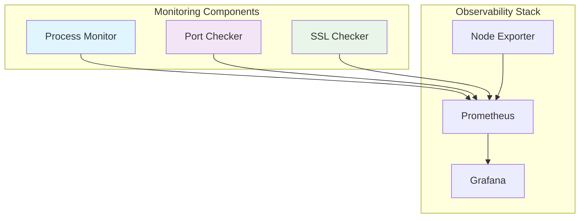

# Monitoring Solutions

A comprehensive monitoring solution with process monitoring, port checking, SSL certificate validation, and full observability stack with Prometheus and Grafana.


## 📊 Overview

Enterprise-grade monitoring infrastructure that provides:
- **Process Monitoring** - Real-time process health checks and metrics
- **Port Availability** - TCP port monitoring with Prometheus metrics
- **SSL Certificate Validation** - SSL/TLS certificate expiration monitoring
- **Full Observability Stack** - Integrated Prometheus + Grafana dashboarding

## 🏗️ Architecture



## 🚀 Features

### 🔍 Process Monitor
- Real-time process health monitoring
- CPU/Memory usage metrics
- Automatic process restart capabilities
- Prometheus metrics endpoint

### 🚪 Port Checker
- TCP port availability monitoring
- Configurable check intervals
- Latency measurements
- Prometheus metrics integration

### 🔐 SSL Checker
- SSL/TLS certificate expiration monitoring
- Multiple domain support
- Certificate chain validation
- Early warning alerts

### 📈 Observability
- Pre-configured Grafana dashboards
- Prometheus metrics collection
- Alertmanager integration
- Ready-to-use monitoring templates

## 📦 Installation

### Prerequisites
- Bash 4.0+
- Netcat (nc)
- curl
- openssl
- procps

### Quick Start

```bash
# Clone the repository
git clone https://github.com/13winged/monitoring-solutions.git
cd monitoring-solutions

# Install dependencies (Ubuntu/Debian)
sudo apt-get update
sudo apt-get install -y netcat-openbsd curl openssl procps

# Configure and run port checker
cd port-checker
cp examples/port-checker.conf /etc/port-checker.conf
# Edit configuration
vim /etc/port-checker.conf
./scripts/start.sh
```

## ⚙️ Configuration

### Port Checker Configuration
```bash
# /etc/port-checker.conf
HOST="example.com"
PORT=443
CHECK_INTERVAL=60
LOG_FILE="/var/log/port-checker.log"
METRICS_DIR="/var/lib/node_exporter"
```

### Process Monitor Configuration
```bash
# /etc/process-monitor.conf
PROCESS_NAME="nginx"
CHECK_INTERVAL=30
RESTART_ATTEMPTS=3
```

## 🐳 Docker Deployment

```bash
# Build the image
docker build -t monitoring-solutions:latest .

# Run with custom configuration
docker run -d \
  -v ./config:/app/config \
  -p 9090:9090 \
  monitoring-solutions:latest

# Or use docker-compose
docker-compose up -d
```

## 📊 Grafana Dashboards

Pre-configured dashboards include:
- **Infrastructure Overview** - System health and resource usage
- **Network Monitoring** - Port availability and latency
- **SSL Certificate Health** - Certificate expiration timeline
- **Process Analytics** - Process performance and restart history


## 🔧 Development

### Project Structure
```
monitoring-solutions/
├── port-checker/          # Port monitoring component
│   ├── scripts/
│   ├── examples/
│   └── src/
├── ssl-checker/           # SSL certificate monitoring
│   ├── scripts/
│   ├── examples/
│   └── src/
├── process-monitor/       # Process monitoring
│   ├── scripts/
│   ├── examples/
│   └── src/
├── docker/                # Docker configurations
├── scripts/               # Common utilities
├── docs/                  # Documentation
└── examples/              # Configuration examples
```

### Running Tests

```bash
# Run all tests
./scripts/run-tests.sh

# Test specific component
cd port-checker
./scripts/test.sh

# Lint checking
find . -name "*.sh" -exec shellcheck {} \;
```

## 📈 Metrics Exported

### Port Checker Metrics
```prometheus
# HELP port_checker_up Port availability check result
# TYPE port_checker_up gauge
port_checker_up{host="example.com",port="443"} 1

# HELP port_checker_check_duration_seconds Check duration
# TYPE port_checker_check_duration_seconds gauge
port_checker_check_duration_seconds 0.5
```

### Process Monitor Metrics
```prometheus
# HELP process_monitor_up Process status
# TYPE process_monitor_up gauge
process_monitor_up{process="nginx"} 1

# HELP process_monitor_restarts_total Process restart count
# TYPE process_monitor_restarts_total counter
process_monitor_restarts_total{process="nginx"} 2
```

## 🤝 Contributing

1. Fork the repository
2. Create a feature branch (`git checkout -b feature/amazing-feature`)
3. Commit changes (`git commit -m 'Add amazing feature'`)
4. Push to branch (`git push origin feature/amazing-feature`)
5. Open a Pull Request

## 🙏 Acknowledgments

- Prometheus Community
- Grafana Labs
- Open Source Monitoring Tools